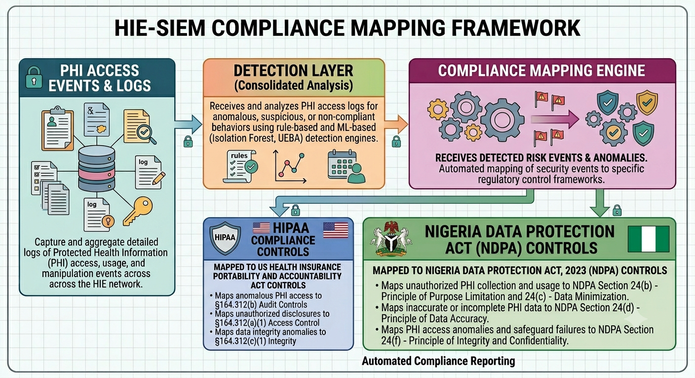
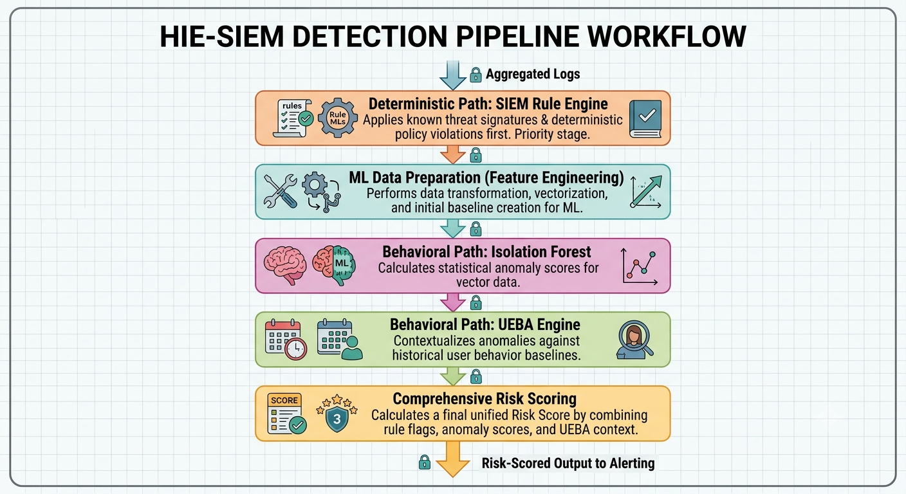
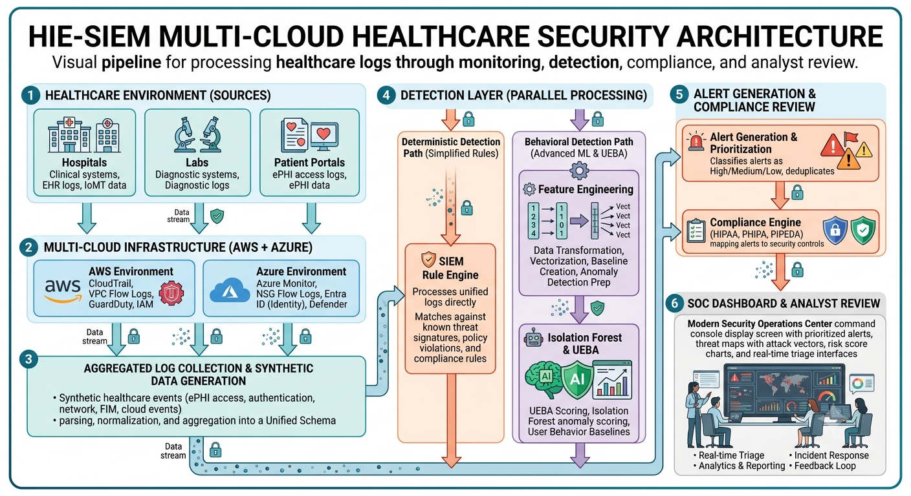

# HIE Cross-Cloud SIEM & Wazuh Security Framework

> A production-grade security monitoring framework for **Health Information Exchange (HIE)** environments, spanning **AWS Canada Central** and **Azure Canada Central**. Built to meet **HIPAA**, **PHIPA**, and **PIPEDA** compliance requirements with real-time log aggregation, distributed anomaly detection, and centralized threat correlation.

---
---

## Implementation Status

This repository is a portfolio-grade healthcare SIEM framework and reference implementation. It contains infrastructure templates, Wazuh configuration structure, detection-rule organization, SIEM pipeline design, and Python-based anomaly detection components.

The framework is intended for cybersecurity research, cloud security architecture review, and portfolio demonstration. It is not intended for direct production deployment without environment-specific hardening, access-control review, secrets management, compliance validation, and security testing.

A separate Streamlit-based local dashboard demo is being developed to visually demonstrate synthetic healthcare log generation, SOC dashboards, alert triage, anomaly detection, UEBA scoring, and compliance monitoring.

## Architecture Overview







```
┌─────────────────────────────────────────────────────────────────────┐
│                     HIE Cross-Cloud Security Fabric                  │
│                                                                       │
│  ┌──────────────────────┐          ┌──────────────────────────────┐  │
│  │   AWS Canada Central  │          │   Azure Canada Central        │  │
│  │   (ca-central-1)      │◄────────►│   (canadacentral)             │  │
│  │                       │  VPN /   │                               │  │
│  │  ┌─────────────────┐  │  Private │  ┌──────────────────────┐    │  │
│  │  │  Wazuh Manager  │  │  Link    │  │  Azure Sentinel SIEM │    │  │
│  │  │  (Primary)      │  │          │  │  Log Analytics WS    │    │  │
│  │  └────────┬────────┘  │          │  └──────────┬───────────┘    │  │
│  │           │            │          │             │                 │  │
│  │  ┌────────▼────────┐  │          │  ┌──────────▼───────────┐    │  │
│  │  │  OpenSearch     │  │          │  │  Azure Monitor        │    │  │
│  │  │  (Log Store)    │◄─┼──────────┼─►│  Diagnostic Logs      │    │  │
│  │  └─────────────────┘  │          │  └──────────────────────┘    │  │
│  │                        │          │                               │  │
│  │  ┌─────────────────┐  │          │  ┌──────────────────────┐    │  │
│  │  │  Wazuh Agents   │  │          │  │  Wazuh Agents         │    │  │
│  │  │  (EC2 + EKS)    │  │          │  │  (VMs + AKS)          │    │  │
│  │  └─────────────────┘  │          │  └──────────────────────┘    │  │
│  └──────────────────────┘          └──────────────────────────────┘  │
│                                                                       │
│              ┌────────────────────────────────┐                      │
│              │  Unified Anomaly Detection      │                      │
│              │  Python ML Pipeline             │                      │
│              │  (Isolation Forest + UEBA)      │                      │
│              └────────────────────────────────┘                      │
└─────────────────────────────────────────────────────────────────────┘
```

---

## Project Structure

```
hie-siem-project/
├── terraform/
│   ├── aws/                    # AWS foundation (VPC, IAM, KMS, S3, GuardDuty)
│   ├── azure/                  # Azure foundation (VNet, NSG, Key Vault, Sentinel)
│   └── modules/
│       ├── networking/         # Cross-cloud VPN tunnel module
│       ├── iam/                # Federated identity module
│       └── logging/            # Centralized log pipeline module
├── wazuh/
│   ├── manager/                # Wazuh manager config (ossec.conf, rules)
│   ├── worker/                 # Worker node config for distributed analysis
│   └── dashboard/              # Kibana/OpenSearch Dashboard configs
├── siem/
│   ├── logstash/               # Logstash pipelines (input → filter → output)
│   ├── filebeat/               # Filebeat modules per cloud source
│   └── opensearch/             # Index templates, ILM policies, mappings
├── detection-rules/
│   ├── hipaa/                  # HIPAA Security Rule mapped Wazuh rules
│   ├── phipa/                  # Ontario PHIPA-specific rules
│   ├── network/                # Network anomaly rules (VPC Flow, NSG)
│   └── anomaly/                # ML-assisted detection rules
├── scripts/
│   ├── python/                 # Anomaly detection, UEBA, log correlation
│   └── bash/                   # Agent deployment, health checks, rotation
├── docs/
│   ├── diagrams/               # Architecture, data flow, threat model
│   └── decisions/              # Architecture Decision Records (ADRs)
└── dashboards/                 # OpenSearch + Sentinel dashboard exports
```

---

## Key Design Decisions

### Why Wazuh over Splunk/Elastic SIEM?
- **Open-source** with no per-GB ingestion licensing — critical for HIE environments with high log volumes
- Native **HIPAA and PCI-DSS rule sets** out of the box
- Built-in **FIM (File Integrity Monitoring)** for ePHI file access auditing
- **Vulnerability detection** module maps directly to PHIPA risk assessment requirements

### Why AWS + Azure (not single cloud)?
- Canadian HIE environments often span **Ministry of Health (Azure/M365)** and **hospital EHR systems (AWS)**
- Regulatory requirement for **geographic data residency** satisfied by both `ca-central-1` and `canadacentral`
- **Azure Sentinel** provides native integration with M365, AD, and Defender — dominant in Ontario healthcare
- **AWS GuardDuty** provides ML-based threat detection native to AWS workloads

### Why OpenSearch over Elastic Cloud?
- **No licensing cost** at scale — Elastic changed licensing in 2021; OpenSearch remains Apache 2.0
- AWS OpenSearch Service available in `ca-central-1` with **FIPS 140-2** endpoints
- Full compatibility with existing Kibana dashboards

### Log Normalization Strategy
All logs are normalized to **ECS (Elastic Common Schema)** before ingestion regardless of source cloud. This enables unified correlation rules that work across AWS CloudTrail, Azure Activity Logs, VPC Flow Logs, and NSG Flow Logs without source-specific logic in detection rules.

---

## Compliance Mapping

| Control | HIPAA § | PHIPA | Implementation |
|---|---|---|---|
| Audit Controls | 164.312(b) | S.12(1)(b) | Wazuh FIM + CloudTrail + Azure Monitor |
| Access Control | 164.312(a)(1) | S.12(1)(a) | IAM policies + Wazuh UEBA rules |
| Transmission Security | 164.312(e)(2)(ii) | S.12(1)(d) | TLS 1.3 enforcement and KMS encryption |
| Integrity Controls | 164.312(c)(1) | S.13 | S3 Object Lock and immutable log storage |
| Emergency Access | 164.312(a)(2)(ii) | S.16 | Break-glass IAM role with alert rule |
| Data Residency | — | S.10 | AWS Canada Central and Azure Canada Central regional enforcement |
| Breach Notification Support | 164.400–414 | S.49 | Alert routing for suspected PHI exposure and unauthorized access |

---

## Quick Start

### Prerequisites
- Terraform >= 1.6
- Docker + Docker Compose >= 2.0
- AWS CLI configured for `ca-central-1`
- Azure CLI configured for `canadacentral`
- Python >= 3.11

### 1. Deploy Cloud Foundation
```bash
# AWS
cd terraform/aws
terraform init
terraform plan -var-file="hie.tfvars"
terraform apply

# Azure
cd terraform/azure
terraform init
terraform plan -var-file="hie.tfvars"
terraform apply
```

### 2. Deploy Wazuh Cluster
```bash
cd wazuh
docker-compose -f docker-compose.cluster.yml up -d
# Dashboard available at https://localhost:5601
# Default creds in .env.example — change before use
```

### 3. Start SIEM Pipeline
```bash
cd siem
docker-compose -f docker-compose.siem.yml up -d
# Logstash listens on :5044 (Beats), :5514 (Syslog)
# OpenSearch at https://localhost:9200
```

### 4. Run Anomaly Detection
```bash
cd scripts/python
pip install -r requirements.txt
python anomaly_detector.py --config config/hie_baseline.yaml
```

---

## Threat Model Summary

**Assets Protected:** ePHI databases, EHR APIs, identity stores, audit logs

**Threat Actors:**
- Insider threat (privileged user ePHI exfiltration)
- Ransomware targeting healthcare (ALPHV/BlackCat pattern)
- Nation-state APT targeting Canadian health infrastructure

**Detection Coverage:**
- `T1078` Valid Accounts — UEBA baseline deviation alerts
- `T1486` Data Encrypted for Impact — FIM + process monitoring
- `T1530` Data from Cloud Storage — S3/Blob access anomaly rules
- `T1071` Application Layer Protocol — DNS tunneling detection

---

## References
- [HIPAA Security Rule](https://www.hhs.gov/hipaa/for-professionals/security/index.html)
- [PHIPA Ontario](https://www.ontario.ca/laws/statute/04p03)
- [PIPEDA](https://www.priv.gc.ca/en/privacy-topics/privacy-laws-in-canada/the-personal-information-protection-and-electronic-documents-act-pipeda/)
- [Wazuh HIPAA Guide](https://documentation.wazuh.com/current/compliance/hipaa/index.html)
- [NIST CSF Healthcare Profile](https://www.nist.gov/system/files/documents/2016/03/09/cybersecurity_framework_hospital-based_medical_device_v1.pdf)
